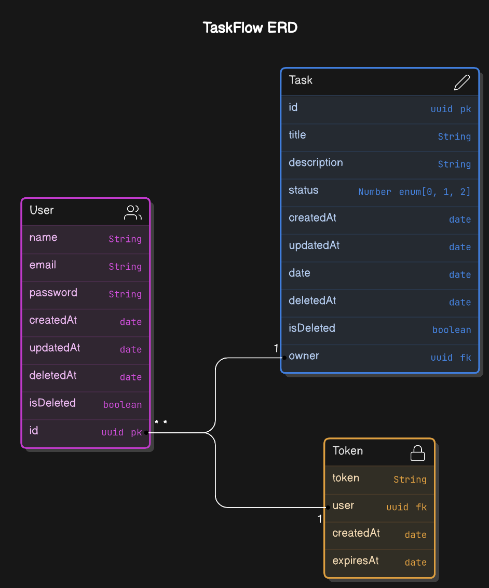

# TaskFlow - Backend
Welcome to TaskFlow Backend, a simple task manager API that allows users to create, read, update and delete tasks.

Just for learning purposes.

## Features
- Create a task
- Read all tasks
- Read a single task
- Update a task
- Delete a task
- Change task status
- Login
- Register
- 

## Technologies
- Node.js
- Express
- MongoDB
- Mongoose
- JWT
- Bcrypt
- Dotenv
- Swagger

## Database Design



## Design Pattern Architecture

- MVC Architecture (Model View Controller)

## Installation
1. Clone the repository
2. Run `npm install` to install all dependencies
3. Create a `.env` file and add the following environment variables:
```
PORT=3000
MONGODB_URI=your_mongodb_uri
JWT_SECRET=your_secret_key
```
4. Run `npm start` to start the server
5. Visit `http://localhost:3000/api-docs` to view the Swagger documentation

## License

This project is licensed under the MIT License - see the [LICENSE](LICENSE) file for details.

## Acknowledgements

- [Mongoose](https://www.npmjs.com/package/mongoose)
- [Express](https://www.npmjs.com/package/express)
- [JWT](https://www.npmjs.com/package/jsonwebtoken)
- [Bcrypt](https://www.npmjs.com/package/bcrypt)
- [Dotenv](https://www.npmjs.com/package/dotenv)
- [Cors](https://www.npmjs.com/package/cors)
- [Nodemon](https://www.npmjs.com/package/nodemon)
- [Swagger JSDoc](https://www.npmjs.com/package/swagger-jsdoc)
- [Swagger UI Express](https://www.npmjs.com/package/swagger-ui-express)
